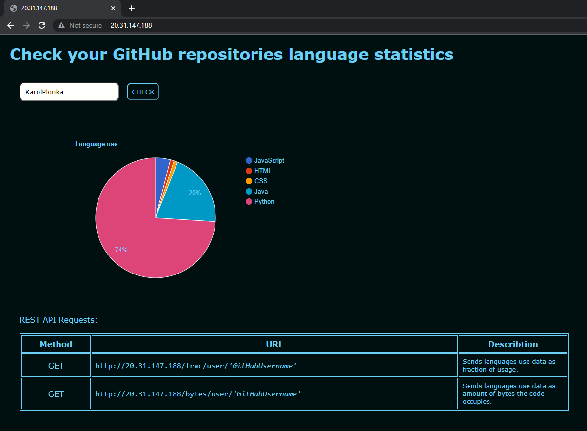

# GitHub-languages-statistic-API
REST API that's allowes you to check your languages statistics over all your public repositories.

 

| Method  | URL | Describtion|
| ------------- | ------------- | ------------- |
| GET  | `http://20.31.147.188/frac/user/'GitHubUsername'`  | Sends languages use data as fraction of usage. |
| GET  | `http://20.31.147.188/bytes/user/'GitHubUsername'`  |Sends languages use data as amount of bytes the code occupies.. |

 

## Website: http://20.31.147.188/

 

## Deployment process:

 

## Used technologies:
- Node.js
- Docker
- DockerHub
- Azure DevOps (Pipelines)
- Azure Kubernetes Service
