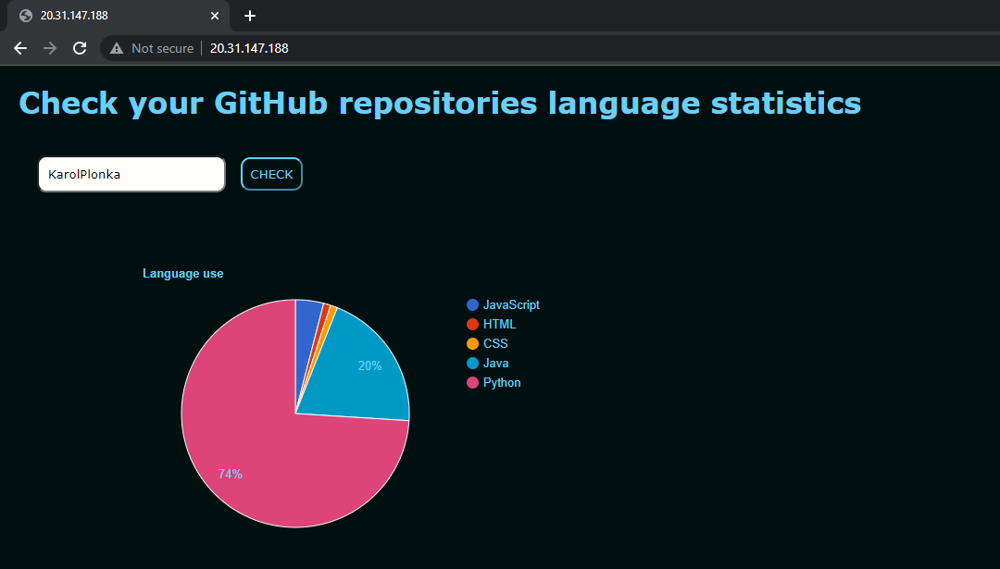

# GitHub-languages-statistic-API &nbsp;&nbsp;&nbsp;&nbsp;&nbsp;&nbsp; 
# Status: Offline :x:

 

REST API that's allowes you to check your languages statistics over all your public repositories.

 

| Method  | URL | Description|
| ------------- | ------------- | ------------- |
| GET  | `http://20.31.147.188/frac/user/'GitHubUsername'`  | Sends languages use data as fraction of usage. |
| GET  | `http://20.31.147.188/bytes/user/'GitHubUsername'`  |Sends languages use data as amount of bytes the code occupies. |

 

## Additional Front-end:

 

## Deployment process:

 

## Used technologies:
- Node.js
- Express.js
- Docker
- DockerHub
- GitHub Actions
- Azure DevOps (Pipelines)
- Azure Kubernetes Service
